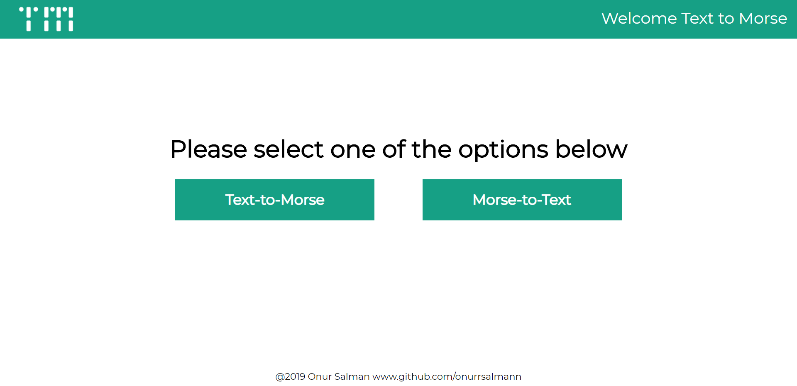
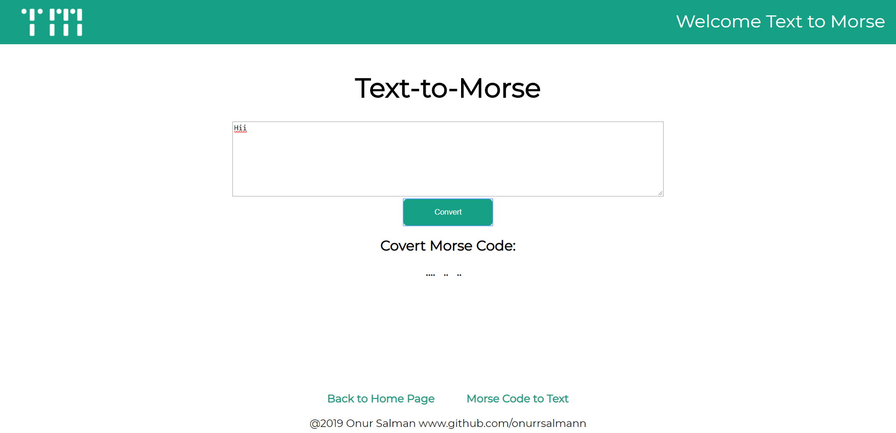
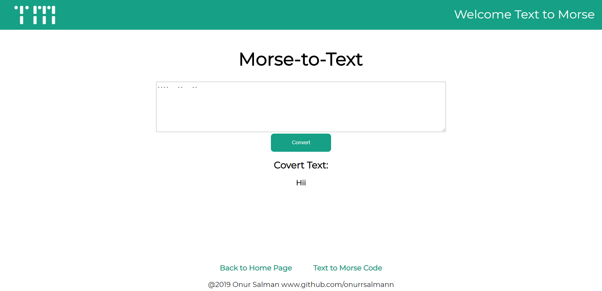

# Text-To-Morse
> This repo converts the Latin alphabet to morse code and the morse code to the Latin alphabet.

## How to use
### Clone
- Clone this repo to your local machine using `https://github.com/onurrsalmann/text-to-morse

### Install 
```
# Install dependencies
# Or yarn install

$ npm install
```
### Run
```
# Server with hot reload at localhost:3000
# Launch server

$ node server
```

### Screenshots





